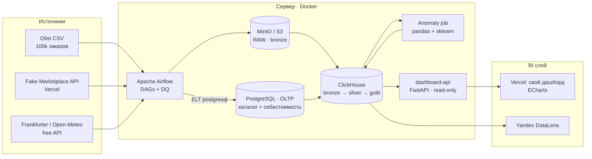

# 🛒📈 E-Commerce Pulse

> Сквозная аналитическая платформа для e-commerce: исторические данные маркетплейса + живой поток цен с автоматической детекцией аномалий. Docker, оркестрация в Airflow, склад на ClickHouse, дашборды на ECharts и Yandex DataLens.

[🚀 Живой дашборд (Vercel)](#) · [🔗 Дашборд DataLens](#) · [📄 Тех-спека](docs/TECH_SPEC.md) · [🗺 Roadmap](docs/ROADMAP.md)

---

## Стек

`Python` · `SQL` · `PostgreSQL` · `ClickHouse` · `MinIO (S3)` · `Apache Airflow (ETL/ELT)` · `Docker` · `pandas` · `NumPy` · `scikit-learn` · `FastAPI` · `ECharts` · `Vercel` · `Yandex DataLens`

## Что внутри

- **Два домена данных в одном складе ClickHouse:**
  - *исторический e-com* (Olist, ~100k реальных заказов) → выручка, AOV, **RFM**, **когортный retention**, **LTV**, SLA доставки, отзывы;
  - *живой поток цен* (Fake Marketplace API на Vercel + курсы валют) → **детекция аномалий** ценообразования (z-score / IsolationForest).
- **OLTP → OLAP:** операционный каталог с себестоимостью в **PostgreSQL**,
  ELT-таск тянет его в ClickHouse через `postgresql()` → витрина **`gold.product_margin`**
  (маржа = живая цена − cost).
- **Медальон-архитектура** bronze → silver → gold (raw в MinIO, витрины в ClickHouse).
- **Airflow** гоняет пайплайны по расписанию (`@hourly` цены + OLTP-sync, `@daily` Olist) с data-quality проверками.
- **ML basics** (`analytics/notebooks/`): pandas/NumPy EDA + supervised-модель прогноза просрочки доставки (train/test, ROC-AUC, важность признаков).
- **Два BI-слоя:** свой дашборд (ECharts на Vercel, поверх `dashboard-api`) + публичный дашборд Yandex DataLens.

## Архитектура



## Быстрый старт (локально/на сервере)

```bash
# 1. секреты
cp .env.example .env && nano .env        # задай пароли

# 2. поднять стек
docker compose up -d

# 3. проверить
docker compose ps
# ClickHouse:  http://<host>:8123/play
# MinIO:       http://<host>:9001
# Airflow:     http://<host>:8080

# 4. инициализация склада (DDL bronze/silver/gold) применяется автоматически
#    из infra/clickhouse/init/*.sql при первом старте ClickHouse

# 5. включить DAG'и в Airflow UI: olist_batch_load → live_pricing_ingest → oltp_sync
```

Полный бесплатный деплой (сервер + DataLens + Vercel) → [`docs/DEPLOY.md`](docs/DEPLOY.md).

## Свой дашборд (Vercel + FastAPI)

Кастомный дашборд на ECharts вместо коробочного BI: фронт — один статический файл на Vercel,
бэк — тонкий read-only слой `dashboard-api` (FastAPI) поверх gold-витрин ClickHouse.

```bash
# бэк уже в общем compose (поднимается вместе со стеком):
docker compose up -d dashboard-api          # → http://<host>:8000/api/kpis
# в проде закрой его HTTPS через Caddy (infra/caddy) — фронт на Vercel требует https.

# фронт — деплой папки dashboard/ на Vercel (статика, без сборки):
cd dashboard && vercel --prod
# домен API задаётся в const API (dashboard/index.html) или через ?api=https://api.<домен>
```

Локально:
```bash
cd dashboard-api && uvicorn app:app --port 8000     # бэк
open "dashboard/index.html"                          # фронт сам найдёт localhost:8000
```

## Структура репозитория

См. [`docs/TECH_SPEC.md` §10](docs/TECH_SPEC.md). Кратко: `docker-compose.yml` (стек), `airflow/dags` (пайплайны), `infra/postgres/init` (OLTP-схема + сид), `infra/clickhouse/init` (DDL склада), `analytics/sql` (gold-витрины), `analytics/anomaly` + `analytics/notebooks` (ML), `fake-marketplace-api` (источник цен), `dashboard-api` + `dashboard` (свой дашборд), `datalens` (инструкция по BI).

## Аналитические витрины

- **RFM** и **когортный retention** по месяцу первой покупки.
- **SLA доставки**: средний срок и доля просрочек по штатам.
- **Маржа** по категориям (цена из потока − себестоимость из OLTP).
- **Ценовые аномалии**: z-score / IQR / IsolationForest.

---

Вопросы и предложения — в Issues.